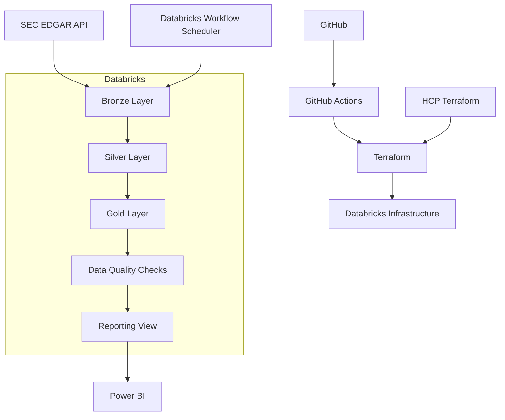
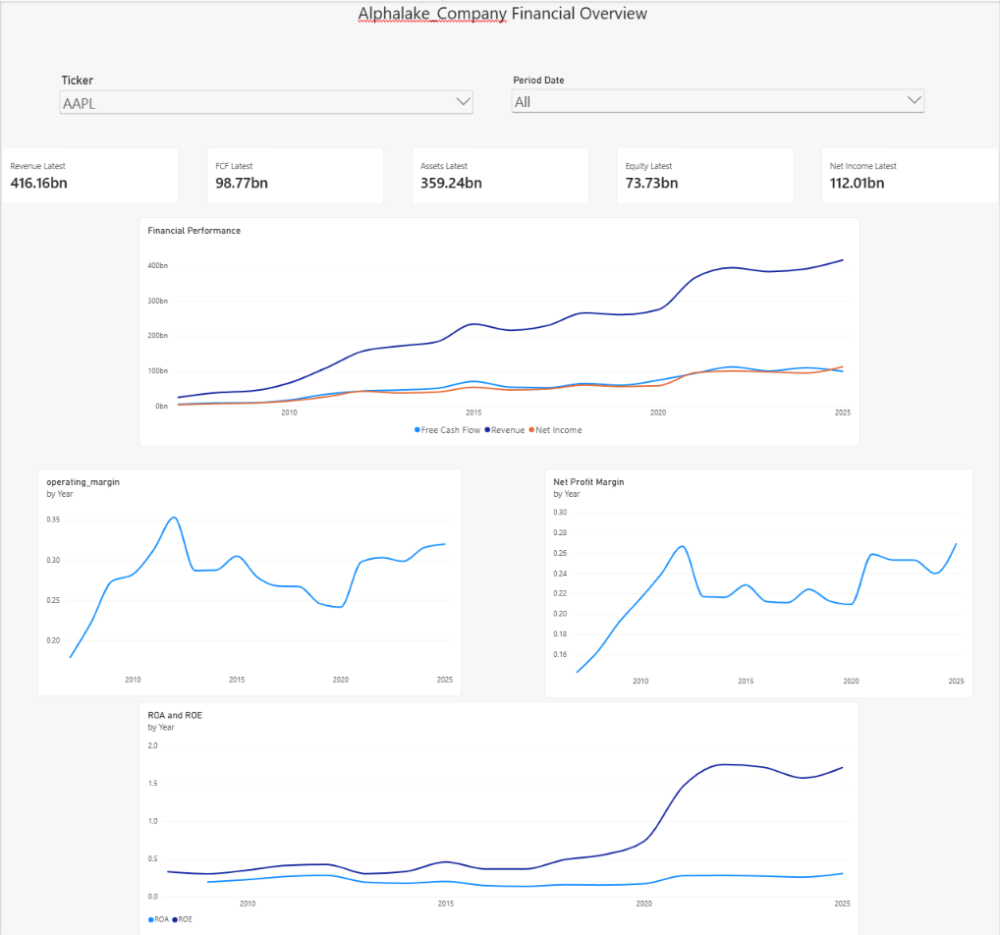

# AlphaLake — Financial Data Lakehouse Platform

AlphaLake is an end-to-end financial data engineering platform that ingests public company financial data from the SEC, transforms it through a Bronze/Silver/Gold lakehouse architecture, validates the resulting analytical dataset, and exposes it to Power BI for financial analysis.

The project was built as a practical Data Engineering project covering the complete lifecycle of a modern data platform:

- Data ingestion
- PySpark transformations
- Medallion architecture
- Delta Lake / Unity Catalog
- Databricks Workflows
- Data quality
- Infrastructure as Code
- Remote Terraform state
- CI/CD with GitHub Actions
- Automated scheduling
- Power BI reporting

---

## Architecture



The main data flow is:

```text
SEC EDGAR
    ↓
Bronze
    ↓
Silver
    ↓
Gold
    ↓
Data Quality
    ↓
Reporting View
    ↓
Power BI
```

Infrastructure deployment is handled separately:

```text
GitHub
    ↓
GitHub Actions
    ↓
Terraform
    ↓
Databricks
```

Terraform state is stored remotely in HCP Terraform.

---

# Project Goals

AlphaLake was designed to answer two different questions at different layers.

### Silver

> How did the SEC report the financial information?

The Silver layer preserves normalized SEC filing facts and filing history.

### Gold

> What does the financial information mean analytically?

The Gold layer converts raw accounting facts into company-level financial metrics suitable for analytics and reporting.

---

# Technology Stack

## Data Engineering

- Python
- PySpark
- SEC EDGAR Company Facts API
- JSON
- Parquet
- Delta Lake
- Apache Iceberg for local experimentation
- Databricks
- Unity Catalog

## Infrastructure

- Terraform
- HCP Terraform
- Databricks Terraform Provider

## CI/CD

- GitHub
- GitHub Actions

## Analytics

- Databricks SQL
- Power BI
- DAX

---

# Repository Structure

```text
alpha-lake/
│
├── data/
│   ├── bronze/
│   ├── silver/
│   └── gold/
│
├── docs/
│
├── infrastructure/
│   └── terraform/
│       ├── providers.tf
│       ├── variables.tf
│       ├── databricks_job.tf
│       └── outputs.tf
│
├── src/
│   ├── bronze/
│   │   └── load_financials.py
│   │
│   ├── ingestion/
│   │   └── sec/
│   │       ├── sec_client.py
│   │       └── ticker_cik.py
│   │
│   ├── silver/
│   │
│   ├── gold/
│   │   ├── company_fundamentals.py
│   │   └── cash_flow_metrics.py
│   │
│   ├── quality/
│   │   ├── gold_quality.py
│   │   └── run_gold_quality.py
│   │
│   ├── infrastructure/
│   │   ├── spark/
│   │   └── storage/
│   │       ├── local.py
│   │       └── databricks.py
│   │
│   └── pipeline.py
│
├── tests/
│
├── .github/
│   └── workflows/
│       └── terraform.yml
│
├── .gitignore
├── pyproject.toml
└── README.md
```

---

# 1. SEC Data Ingestion

Financial data is retrieved from the official SEC EDGAR Company Facts API.

Example endpoint:

```text
https://data.sec.gov/api/xbrl/companyfacts/CIKXXXXXXXXXX.json
```

Ticker symbols are mapped to SEC CIK identifiers before retrieving company facts.

The ingestion layer supports multiple companies and stores the original SEC response in the Bronze layer.

Example:

```text
Ticker
  ↓
Ticker → CIK mapping
  ↓
SEC Company Facts API
  ↓
Raw JSON
```

---

# 2. Bronze Layer

The Bronze layer preserves the original SEC Company Facts JSON.

In Databricks, Bronze files are stored inside a Unity Catalog Volume:

```text
/Volumes/alphalake/raw/data/bronze/sec/<TICKER>/companyfacts.json
```

Example:

```text
/Volumes/alphalake/raw/data/bronze/sec/AAPL/companyfacts.json
```

The Bronze layer intentionally performs minimal transformation.

Its purpose is to preserve the source data for reproducibility and reprocessing.

---

# 3. Silver Layer

The SEC Company Facts JSON contains deeply nested financial facts.

PySpark is used to flatten and normalize these structures into a structured dataset.

The Silver schema contains fields such as:

```text
ticker
concept
unit
accession_number
period_start_date
period_end_date
filing_date
filing_form
fiscal_period
reporting_frame
fiscal_year
value
```

The production Silver table is:

```text
alphalake.silver.financial_facts
```

The Silver layer preserves filing history instead of immediately reducing the data to one value per company and year.

---

# 4. Gold Layer

The Gold layer converts SEC accounting concepts into analytical financial metrics.

The primary table is:

```text
alphalake.gold.company_financials
```

The table contains company-level annual financial metrics including:

```text
ticker
period_date

revenue
net_income
operating_income

assets
equity

operating_margin
net_profit_margin

return_on_assets
return_on_equity

operating_cash_flow
capex
free_cash_flow
```

---

## Financial Metric Logic

Several SEC concepts may represent the same financial meaning.

AlphaLake therefore implements preferred and fallback accounting concepts when building analytical metrics.

Examples include:

```text
Revenue
Operating Cash Flow
Capital Expenditure
```

The Gold layer also tracks source provenance for selected financial metrics.

For example:

```text
operating_cash_flow_source
capex_source
```

---

# 5. Incremental Gold Updates

The business key of the Gold dataset is:

```text
ticker + period_date
```

Before updating the Gold table, AlphaLake compares incoming rows with existing rows.

Only changed or new rows are merged.

Conceptually:

```text
New Gold Dataset
        ↓
Compare against existing Gold
        ↓
New row? ───────────────→ MERGE
Changed row? ───────────→ MERGE
Identical row? ─────────→ Skip
```

This avoids unnecessary table rewrites and unnecessary Delta/Iceberg versions.

---

# 6. Local Development

The project was initially developed locally using PySpark.

Local storage was used for development and experimentation with:

- Parquet
- Apache Iceberg
- Spark SQL
- MERGE operations
- Snapshot history

Apache Iceberg was used locally to understand table formats, snapshot lineage, and change-aware MERGE behavior.

The production Databricks implementation uses Delta Lake and Unity Catalog.

This keeps transformation logic independent from the underlying storage implementation.

```text
Transformation Logic
       ↓
Storage Adapter
   ↙         ↘
Local       Databricks
```

---

# 7. Databricks Lakehouse

The production environment uses Databricks Free Edition with serverless compute.

Unity Catalog structure:

```text
Catalog
└── alphalake
    │
    ├── raw
    │   └── Volume: data
    │
    ├── silver
    │   └── financial_facts
    │
    └── gold
        └── company_financials
```

The full production flow is therefore:

```text
SEC
 ↓
Unity Catalog Volume
 ↓
Silver Delta Table
 ↓
Gold Delta Table
```

---

# 8. Databricks Workflow

The pipeline is implemented as a multi-task Databricks Job.

```text
01_bronze_ingestion
        ↓
02_silver_transform
        ↓
03_gold_transform
        ↓
04_gold_quality
```

Each task has a single responsibility.

### Task 1 — Bronze

Retrieves SEC financial information and stores the raw JSON.

### Task 2 — Silver

Transforms the SEC JSON into normalized financial facts.

### Task 3 — Gold

Builds company-level analytical financial metrics.

### Task 4 — Data Quality

Validates the final Gold dataset.

---

# 9. Data Quality

AlphaLake includes a dedicated Gold-layer quality module:

```text
src/quality/gold_quality.py
```

Current checks include:

### Non-empty dataset

The Gold dataset must contain records.

### Non-null business keys

The following fields cannot be null:

```text
ticker
period_date
```

### Unique business key

The combination:

```text
ticker + period_date
```

must be unique.

If any validation fails, an exception is raised and the Databricks workflow fails.

```text
Gold
 ↓
Quality Check
 ↓
Valid ─────→ Pipeline succeeds
Invalid ───→ Pipeline fails
```

This prevents silent publication of invalid analytical data.

---

# 10. Automated Scheduling

The Databricks workflow is scheduled through Terraform.

Example:

```hcl
schedule {
  quartz_cron_expression = "0 0 7 * * ?"
  timezone_id            = "Europe/Berlin"
  pause_status           = "UNPAUSED"
}
```

The pipeline therefore runs automatically and refreshes financial data without manual intervention.

---

# 11. Infrastructure as Code

Databricks infrastructure is managed using Terraform.

Terraform manages resources such as:

```text
Databricks Jobs
Job Tasks
Task Dependencies
Git Configuration
Serverless Environment
Job Parameters
Job Schedule
```

Example deployment flow:

```text
Terraform Configuration
        ↓
Databricks Provider
        ↓
Databricks Job
```

---

# 12. Remote Terraform State

Terraform state is stored remotely using HCP Terraform.

This allows both local development and GitHub Actions to work with the same infrastructure state.

```text
VS Code
       \
        → HCP Terraform State
       /
GitHub Actions
```

This avoids keeping infrastructure state only on a developer machine.

Sensitive Terraform state files are excluded from Git:

```gitignore
*.tfstate
*.tfstate.*
terraform.tfvars
.terraform/
```

---

# 13. GitHub Actions CI/CD

Infrastructure deployment is automated using GitHub Actions.

The CI pipeline performs:

```text
terraform fmt
terraform init
terraform validate
terraform plan
```

For pushes to the `main` branch, Terraform also executes:

```text
terraform apply
```

The deployment flow is:

```text
Git Push
   ↓
GitHub Actions
   ↓
Terraform Init
   ↓
Terraform Validate
   ↓
Terraform Plan
   ↓
Terraform Apply
   ↓
Databricks Updated
```

Pull requests can therefore validate infrastructure changes before deployment while changes merged into `main` can automatically update Databricks.

---

## GitHub Secrets

Sensitive credentials are stored using GitHub Actions Secrets rather than being committed to Git.

Examples:

```text
TF_API_TOKEN
DATABRICKS_TOKEN
SEC_NAME
SEC_EMAIL
```

Non-sensitive configuration can be stored as GitHub repository variables:

```text
DATABRICKS_HOST
ALPHALAKE_ENV
GITHUB_REPO_URL
```

Terraform variables are passed using the standard environment-variable convention:

```text
TF_VAR_<variable_name>
```

---

# 14. Reporting Layer

Power BI is not connected directly to the internal Gold implementation.

A reporting view provides a stable consumer-facing interface:

```sql
CREATE OR REPLACE VIEW alphalake.gold.v_company_financials_report AS
SELECT
    ticker,
    period_date,
    revenue,
    net_income,
    operating_income,
    assets,
    equity,
    operating_margin,
    net_profit_margin,
    return_on_assets,
    return_on_equity,
    operating_cash_flow,
    capex,
    free_cash_flow
FROM alphalake.gold.company_financials;
```

Architecture:

```text
Gold Table
    ↓
Reporting View
    ↓
Power BI
```

This decouples the reporting layer from the internal Gold-table implementation.

---

# 15. Power BI Dashboard

The Power BI dashboard provides an interactive company financial overview.

Users can select:

```text
Ticker
Period Date
```

The dashboard currently includes:

### Latest Financial KPIs

- Revenue
- Net Income
- Free Cash Flow
- Assets
- Equity

The cards use DAX measures that retrieve the latest available reporting period rather than summing historical values.

Example:

```DAX
Revenue Latest =
VAR LatestDate =
    MAX(v_company_financials_report[period_date])
RETURN
    CALCULATE(
        MAX(v_company_financials_report[revenue]),
        v_company_financials_report[period_date] = LatestDate
    )
```

---

## Historical Financial Performance

The dashboard visualizes:

```text
Revenue
Net Income
Free Cash Flow
```

over time.

---

## Profitability Analysis

Additional charts show:

```text
Operating Margin
Net Profit Margin
```

over time.

---

## Return Metrics

AlphaLake also displays:

```text
Return on Assets
Return on Equity
```

over time.

---

# Current Dashboard

The current dashboard contains:

```text
                     AlphaLake Company Financial Overview

          [ Ticker ]                    [ Period Date ]

 Revenue       FCF        Assets        Equity       Net Income


                    Financial Performance
             Revenue / Net Income / Free Cash Flow


        Operating Margin             Net Profit Margin


                         ROA / ROE
```

The dashboard allows users to interactively analyze the financial history of individual companies.

---

# End-to-End Platform

The completed AlphaLake v1 architecture is:

```text
                        DATA SOURCE

                         SEC EDGAR
                             │
                             ▼
                         BRONZE
                      Raw SEC JSON
                             │
                             ▼
                         SILVER
                Normalized Financial Facts
                             │
                             ▼
                          GOLD
                Analytical Financial Metrics
                             │
                             ▼
                     DATA QUALITY
                             │
                             ▼
                     REPORTING VIEW
                             │
                             ▼
                        POWER BI


                 INFRASTRUCTURE LAYER

GitHub
   │
   ▼
GitHub Actions
   │
   ▼
Terraform ─────────── HCP Terraform State
   │
   ▼
Databricks


                 ORCHESTRATION LAYER

Databricks Workflow
       │
       ├── Bronze
       ├── Silver
       ├── Gold
       └── Quality
       
       ↓

Scheduled execution
```

---

# Key Engineering Concepts Demonstrated

AlphaLake demonstrates practical experience with:

- REST API ingestion
- JSON processing
- PySpark
- Distributed transformations
- Medallion architecture
- Data lakehouse design
- Delta Lake
- Apache Iceberg
- Unity Catalog
- Data modeling
- Financial data normalization
- Incremental processing
- MERGE operations
- Change detection
- Data quality validation
- Databricks Jobs
- Workflow dependencies
- Serverless Databricks
- Infrastructure as Code
- Terraform
- Remote Terraform state
- CI/CD
- GitHub Actions
- Secret management
- Databricks SQL
- DAX
- Power BI

---

# Design Principles

AlphaLake follows several engineering principles.

### Separation of concerns

```text
Ingestion
Transformation
Storage
Quality
Infrastructure
Reporting
```

are implemented as separate responsibilities.

### Storage-independent transformations

Transformation logic does not depend directly on whether the platform runs locally or in Databricks.

### Reproducible infrastructure

Databricks infrastructure is defined as code using Terraform.

### Automated deployment

Infrastructure changes are deployed through GitHub Actions rather than manual configuration.

### Data quality before consumption

Analytical data is validated before being treated as trusted reporting data.

### Stable reporting contract

Power BI consumes a dedicated SQL view instead of depending directly on internal Gold-table implementation details.

## Dashboard Preview



---

# Future Improvements

Possible future extensions include:

- Additional companies
- Daily stock-market prices
- Market-data APIs
- Financial growth metrics
- Revenue CAGR
- FCF growth
- FCF margin
- Debt ratios
- ROIC
- Company comparison dashboard
- Quality / Value / Risk scoring
- Portfolio analytics
- News and SEC filing ingestion
- Streaming market data
- dbt transformation layer
- Additional automated data-quality checks
- Alerting and monitoring
- AWS deployment

These features are intentionally outside the scope of AlphaLake v1.

The current version focuses on building a reliable, automated end-to-end financial data platform before adding additional complexity.

---

# Project Status

**AlphaLake v1: Complete**

Current platform capabilities:

```text
SEC ingestion               ✅
Bronze layer                ✅
Silver layer                ✅
Gold layer                  ✅
Incremental processing      ✅
Databricks migration        ✅
Unity Catalog               ✅
Databricks Workflow         ✅
Automated scheduling        ✅
Data quality                ✅
Terraform IaC               ✅
HCP remote state            ✅
GitHub Actions CI/CD        ✅
Reporting SQL view          ✅
Power BI dashboard          ✅
```

---

# Author

Built as a hands-on Data Engineering and Lakehouse project demonstrating the design, implementation, deployment, automation, and consumption of a modern analytical data platform.